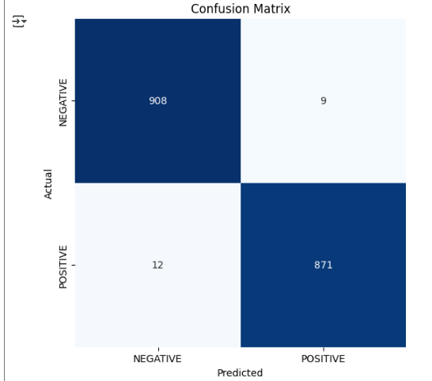

# Surface Crack Detection

Surface Crack Detection tackles the problem of manual defect identification in construction and manufacturing by automating the process with deep learning. Using a Convolutional Neural Network (CNN), the project classifies images into **Crack (Positive)** and **No Crack (Negative)** categories, streamlining defect monitoring and ensuring structural safety.

## Live Demo

[Demo Video](https://drive.google.com/file/d/1IHmbkBtVIoGp1UVbr2qqfENc4vlId2Vu/view?usp=sharing)

## Try It Out!

Run the notebook in Google Colab and link your Kaggle account to download and train on the dataset.

## Dataset Reference

#### Kaggle Dataset

https://www.kaggle.com/datasets/arunrk7/surface-crack-detection


## Screenshots
  
  
  
  

## Tech Stack

**Core Frameworks:**
* TensorFlow / Keras
* Scikit-learn

**Data Handling & Visualization:**
* Pandas
* Numpy
* Matplotlib
* Seaborn
* Plotly
* OpenCV

**Environment & Tools:**
* Google Colab
* Kaggle API
* Python 3

## Features

- Automated dataset download using **Kaggle API**  
- End-to-end pipeline for **data preprocessing, training, and evaluation**  
- CNN model with convolution, pooling, and dense layers for binary classification  
- Performance evaluation with **confusion matrix, classification report, R² score**  
- Functions for **real-world testing on unseen images** with confidence scoring  

## Run Locally (Colab)

1. Clone the project:

```bash
  git clone https://github.com/UmarSkh/Surface-Crack-Detection.git
```

2. Upload kaggle.json to Colab and move it to the ~/.kaggle/ folder:

```
from google.colab import files
files.upload()
!mkdir -p ~/.kaggle
!cp kaggle.json ~/.kaggle/
!chmod 600 ~/.kaggle/kaggle.json
```

3. Download and unzip the dataset:

```
!kaggle datasets download -d arunrk7/surface-crack-detection
!unzip -q surface-crack-detection.zip -d surface-crack-detection
```

4. Open and run the notebook to train the CNN.

## Authors

- [@UmarSkh](https://github.com/UmarSkh)

## Contributing

Contributions are always welcome! Feel free to fork the repository and make a pull request.

### How to Contribute
- Fork the repository.
- Create a new branch (```git checkout -b feature-branch```).
- Make your changes.
- Commit your changes (```git commit -m 'Add new feature'```).
- Push to the branch (```git push origin feature-branch```).
- Open a pull request.


## Lessons Learned

This project deepened my understanding of Convolutional Neural Networks, data pipelines, and evaluation metrics in image classification. I gained hands-on experience with TensorFlow/Keras, managing Kaggle datasets via API, and visualizing training dynamics with Matplotlib/Plotly. Additionally, I strengthened my skills in handling imbalanced datasets, preventing overfitting with early stopping, and testing models on unseen real-world data.

## Feedback

If you have any feedback, please let me know.